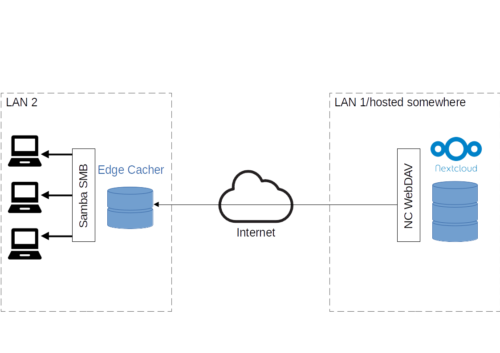

# Edge Cacher

This little helper will setup [rclone](https://rclone.org/) to provide a persistently (survives reboot) mounted virtual filesystem on linux with systemd. Optionally a Samba share is setup to share the mounted virtual filesystem via network.

The original purpose of this is to provide a small and easy appliance, which can cache data on a site remotely from a main nextcloud instance with limited bandwith and serve the files with higher speed to the remote network.



This can all be done manually, the script basically just glues existing things together (well, just sets them up) for potentially easier use. Therefore not all possibilities of the underlying tools are exposed via this "installer" script.

## Use-Case 1: nextcloud virtual filesystem on a Ubuntu/Debian machine with rolling cache

You might have one or multiple nextcloud instances which hold more data than your laptop can hold. 
You can use the nextcloud client and select a subset of data you want to synchronize locally. This data will be available to you if you are connected or not to the internet/nextcloud system.
The alternative is a virtual filesystem. Here you have initially none of the data on the computer. But it looks to you, as if the data would be local. To speed up things, everything you touch will be saved locally in the background. So the second time you need the file, it will be already available (if it was not changed remotely in the meantime) on your machine and it will open as fast as locally.
You can specify the amount of cache you want to hold locally.
This implementation ist not quite yet like the Dropbox implementation, as you need to be connected to the server in order to access your files (it needs to check the data you are accessing changed).

Example `config.json`:
```
{
    "share_name": "my-share",
    "remote": {
        "username": "user",
        "password": "my-secret",
        "url": "https://my.nextcloud.instance.tld/remote.php/dav/files/<your-username>"
    },
    "vfs": {
        "cache_dir": "/path/to/a/non/fat32/drive",
        "vfs_cache_max_size": "512m"
    }
}
```


## Use-Case 2: provide a cache of a remote server locally and serve it via windows share

Another case (the original one for this project) is the situation, that you have two locations you are many operating in - e.g. your nextcloud instance is located in A, but you are also quite often in location B and you want to have fast access to your data when you are at B. For some reason, you cannot or don't want to store all the data locally on your device. 

So you setup a different device (e.g. a raspberry pi with a hard drive) and put it in Bs network. Using the edge cacher, you can setup the raspberry pi to serve your nextcloud data via a windows share (smb). Data which was touched/accessed by the user will be cached on the Raspberry Pi's hard drive. If the drive gets full, the least recently used data will be expunged from the cache.

This allows you to have mostly local network transfer speed without the need for a complete replication of *all* your storage in location B.

This setup allows you furthermore to hide slow transfer times between location A and location B for clients in location B. You can quickly save a big document in location B, close your computer/go offline, and the data will be uploaded in the background by the edge cacher.

This also means, that for a moment (until the upload is complete), clients in location B will see a different state than clients in location A! So be aware of this limitation.

Example `config.json`:
```
{
    "share_name": "my-share",
    "remote": {
        "username": "user",
        "password": "my-secret",
        "url": "https://my.nextcloud.instance.tld/remote.php/dav/files/<your-username>"
    },
    "smb": {
	    "password": "my-different-secret"
    },
    "vfs": {
        "cache_dir": "/path/to/a/non/fat/drive",
        "vfs_cache_max_size": "512m"
    }
}
```


## Installation
```
apt install python3 python3-click samba             # samba only if you plan to serve via Windows share
curl https://rclone.org/install.sh | sudo bash      # latest rclone
git clone https://github.com/x42x64/edge_cacher.git
cd edge_cacher
./edge_cacher.py --help
```

### Setup your first edge cache
```
cp demo.json my-config.json
# modify my-config.json to your liking
```
Now create the mount
```
sudo ./edge_cacher.py add my-config.json
```

To list all configurations for the current user:
```
sudo ./edge_cacher.py ls
```

Your data now is accessible at `/mnt/edge-cacher/<your share name>`.
If you have a samba server installed and you provided a `smb` key in the json config, your data should now be also accessible at:
```
\\<your ip>\<your share name>
user: <your share name>_user
pw: <as provided in the json config under the smb section>
```


## Usage
```
Usage: edge-cacher.py [OPTIONS] COMMAND [ARGS]...

  A tool to configure rclone and systemd to mount nextcloud webdav shares
  and potentially serve them via samba.

Options:
  --help  Show this message and exit.

Commands:
  add     Add an edge cache by providing a JSON config as CONFIGFILE
  ls      List all configured edge caches by this user.
  remove  Remove an edge cache by its name like displayed with `ls`.
```

For example json configs, check above.
Further (optional) settings for rclone (vfs):

Attribute|default|comment
---------|-------|-------
cache_dir|required|
vfs_cache_max_size| required
vfs_cache_max_age|"8760h"|
vfs_cache_mode|"full"|
vfs_cache_poll_interval|"1m"
vfs_write_back|"5s"|
vfs_read_chunk_size|"64M"|
buffer_size|"16M"|
vfs_read_ahead|"512M"|
poll_interval|"30s"|
dir_cache_time|"5m"|
attr_timeout|"1s"|Don't set this to 0, it might break [things](https://rclone.org/commands/rclone_mount/#attribute-caching)

A detailed explaination of these settings can be found on the [rclone website](https://rclone.org/commands/rclone_mount/).

## Known Limitations
* Very limited testing so far, no test suite. Consider it alpha.
* No conflict handling. If timing is really unfortunate, one could overwrite other people's file version (Person A saves something, Person B saves something at the same place. The one who saves last will win. Like with basically all shared file-systems)
* Passwords in the configuration json are clear text (!)
* When removing a share, the cache is not automatically deleted. Do manually delete it at the location you specified in the json file.

## Implementation Details
* Dynamically generated config files are stored in `$HOME/.config/edge-cacher/<share_name>`
* All rclone vfs mounts are located in `/mnt/edge-cacher/<share_name>`
* All mounts are mounted in mode `777` (all the rights to everybody), as this solved some issue for me with deleting/uploading data using the samba share
* When also sharing as SMB share, a local user `<share_name>_user` is added, which belongs to the group edge-cacher. 


## Ideas for the future
* Gui
* Config support for more backends (all rclone supported backends)
* More serving options
* Convergence with remote Nextcloud (poor man's replication)

## Troubleshooting
This section needs to be done. Just a few command snippets:

* Is rclone running?
  ```
  # logs
  journalctl -t rclone

  # systemd status
  systemctl status edge-cacher-<share name>
  ```

* Is samba running?
  ```
  sudo systemctl status smbd.service
  ```

* Is the certificate trusted?
  If you are using a self signed certificate, don't forget to add it to your trusted certifcates
  You can check this by running:
  ```
  sudo systemctl status edge-cacher-<share name>

  # Output
  # IO error: couldn't list files: Propfind "<your nextcloud url>": tls: failed to verify certificate: x509: certificate signed by unknown authority
  ```

  You can fix this error by add your certificate to `/usr/local/share/ca-certificates/` (Ubuntu) and then run:
  ```
  sudo update-ca-certificates
  ```


* Manual cleanup
  * remove include from `/etc/samba/smb.conf`
  * restart samba 
  * stop rclone service
  * remove from systemd
  * remove config
  * remove mount directory
